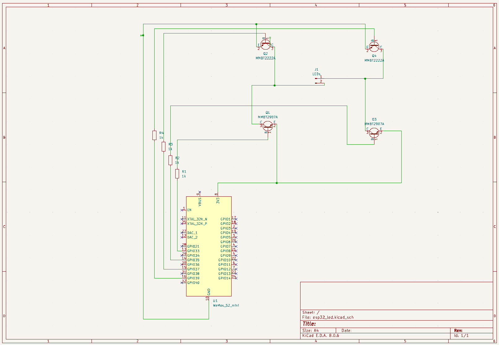
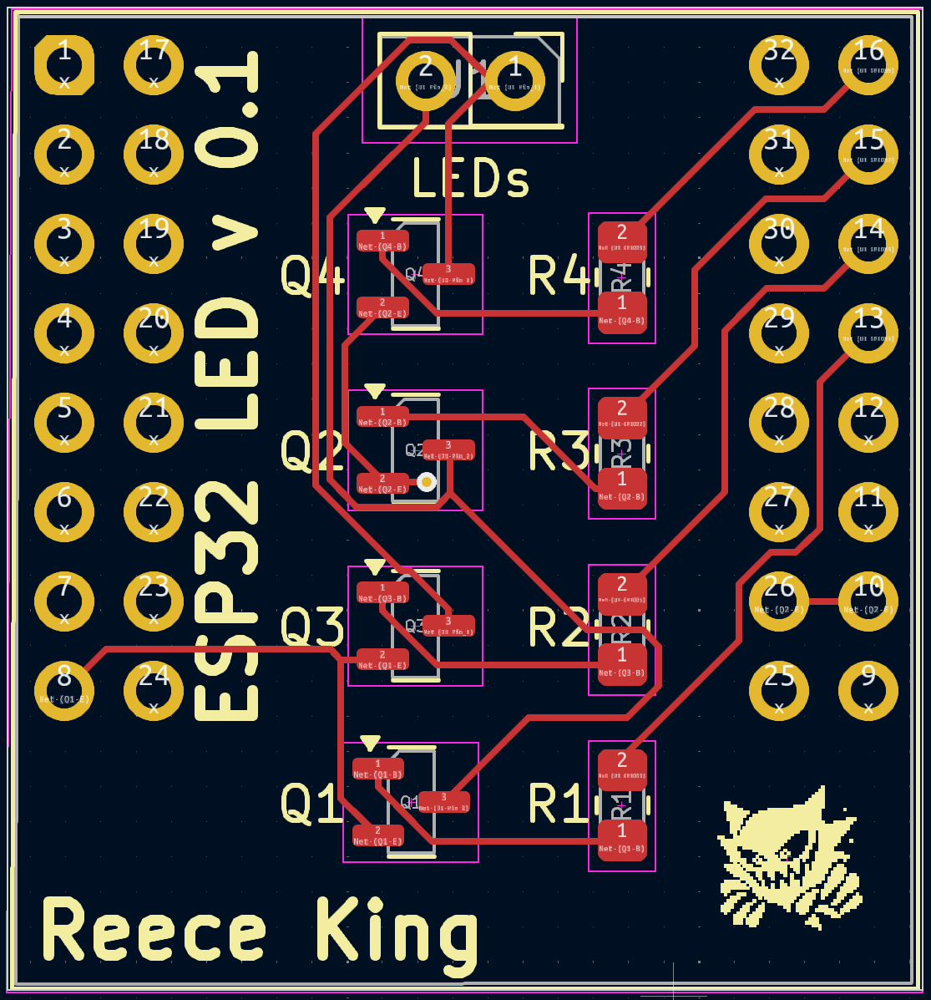
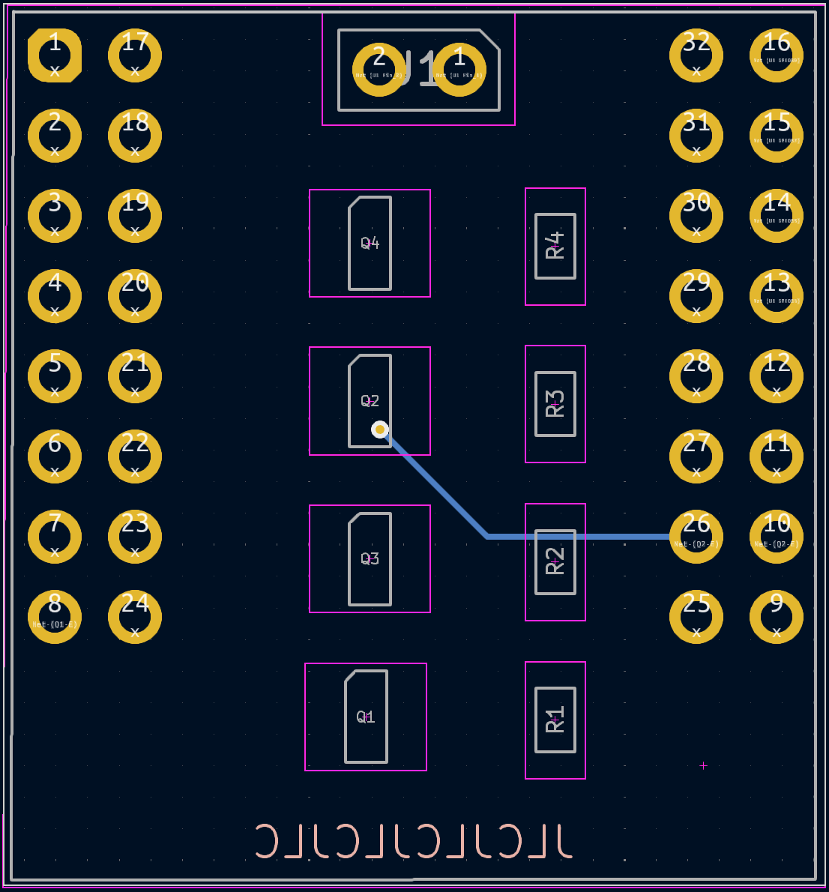
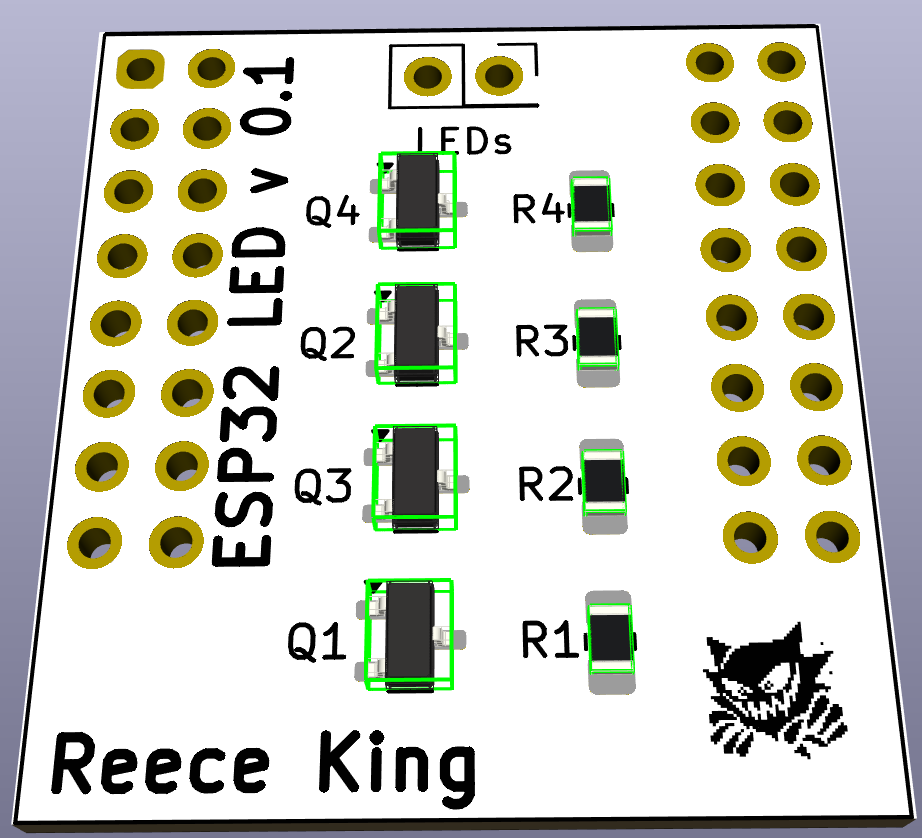
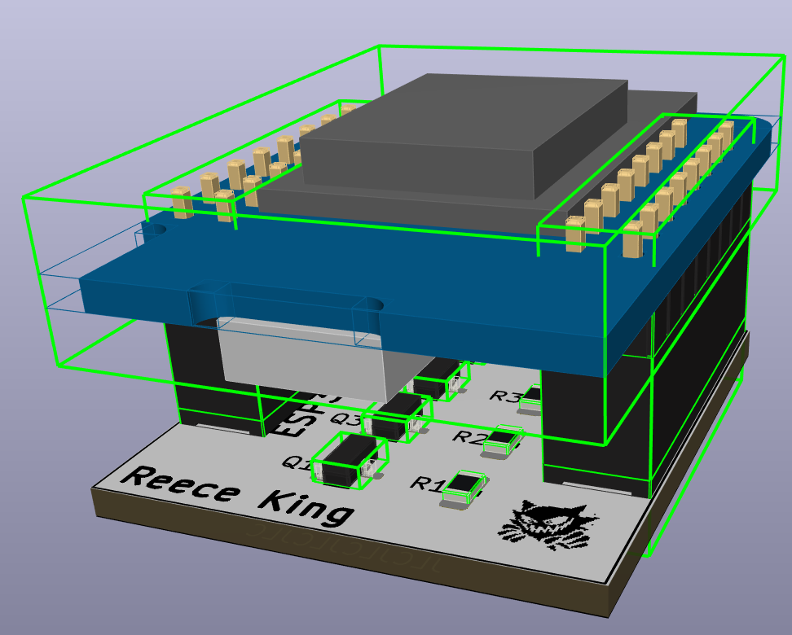

# ESP32 LED Controller

Schematic and PCB design for an ESP32, specifically a Wemos Lolin D2 mini shield to control low power (~200mA) monochromatic fairy lights. These monochromatic fairy lights function as bidirectional LEDs, where alternating the polarity on the two wires changes which half of the LEDs illuminate.

## Why?

My wife frequently purchases cheap battery/USB monochrome string lights on clearance at stores locally. I wanted to be able to take advantage of these lights to automate them in my home automation system.

I was looking for a device to satisfy the following requirements:
* The device should be able to control at least one set of string lights.
* The device should be able to control the brightness of the lights.
* The device should be able to control them via  [Home Assistant](https://home-assistant.io/).

## Software
ESPHome configuration:
https://github.com/kingmercian/esphome/blob/4c16731de8fa22333e613f6e8b42984a3e44136c/curtain-leds.yaml

## Schematic

## PCB
 

## Render
 

## Parts List
| Part | Type | Footprint | Designator  | Quantity
|--|--|--|--|--|
| ESP32 S2 Mini | Microcontroller | N/A | N/A | 1 |
| 1K | Resistor| 0805 | R1, R2, R3, R4 | 4 |
| MMBT2907 | Transistor | SOT-23 | Q1, Q3 | 2 |
| MMBT2222 | Transistor | SOT-23 | Q2, Q4 | 2 |

## Issues
None for my usage but if I build these in future I would make some changes:
* add a diode between the transistor and LED output
* add terminal blocks to attach LEDs
* add button to toggle through LED patterns (control through software)
* add switch to disable LED output
